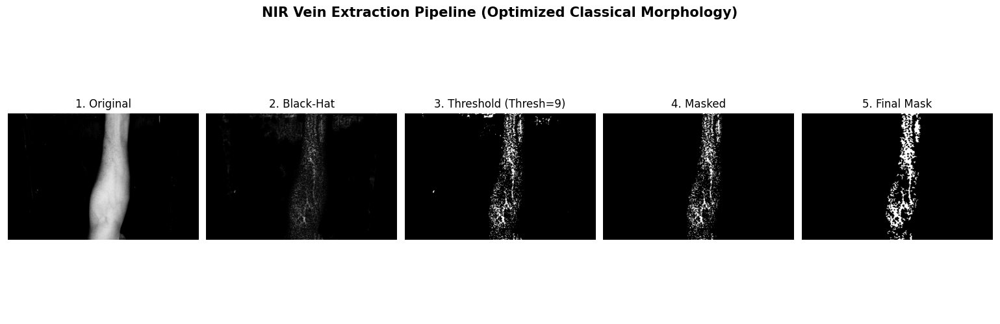
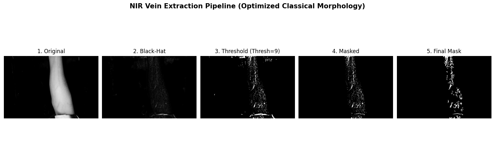

# Domain-Resilient NIR Vein Extraction Pipeline

This repository contains a classical computer vision pipeline for non-invasive vein extraction from Near-Infrared (NIR) forearm images. It was developed to prioritize resilience against domain shifts, such as varying hardware illumination and physical artifacts.

## Pipeline Architecture
The pipeline avoids deep learning and adaptive thresholding (which amplifies sensor noise), relying instead on morphological operations to flatten illumination.

1. **Arm ROI Isolation:** Heavy erosion (45x45) to ignore boundary shadows and physical edge artifacts.
2. **Contrast Enhancement:** CLAHE (clip limit 2.5) to pull faint, deep veins out of the background.
3. **Noise Suppression:** Gaussian Blur (15x15) to eliminate skin pores and hair follicles.
4. **Illumination Flattening:** Morphological Black-Hat transform (45x45) to isolate dark valley structures (veins) regardless of global lighting gradients.
5. **Global Thresholding:** A strict threshold of 9 cleanly separates the vascular signal.
6. **Morphological Cleanup:** Smart opening/closing and area filtering to remove residual sensor grain.

## Results

The pipeline successfully extracts primary vascular networks while completely ignoring physical artifacts like adhesive medical tape.

**Example: Successful Vascular Extraction**


**Example: Artifact Rejection (Medical Tape/Wristband)**


## How to Run
Install the dependencies:
```bash
pip install -r requirements.txt
